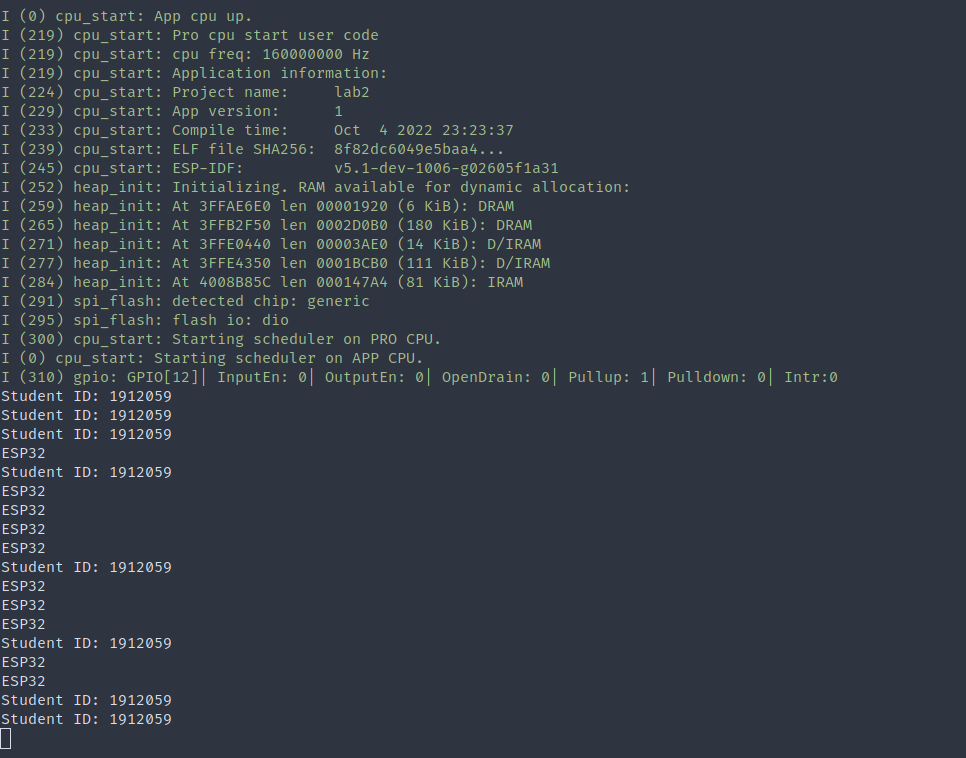
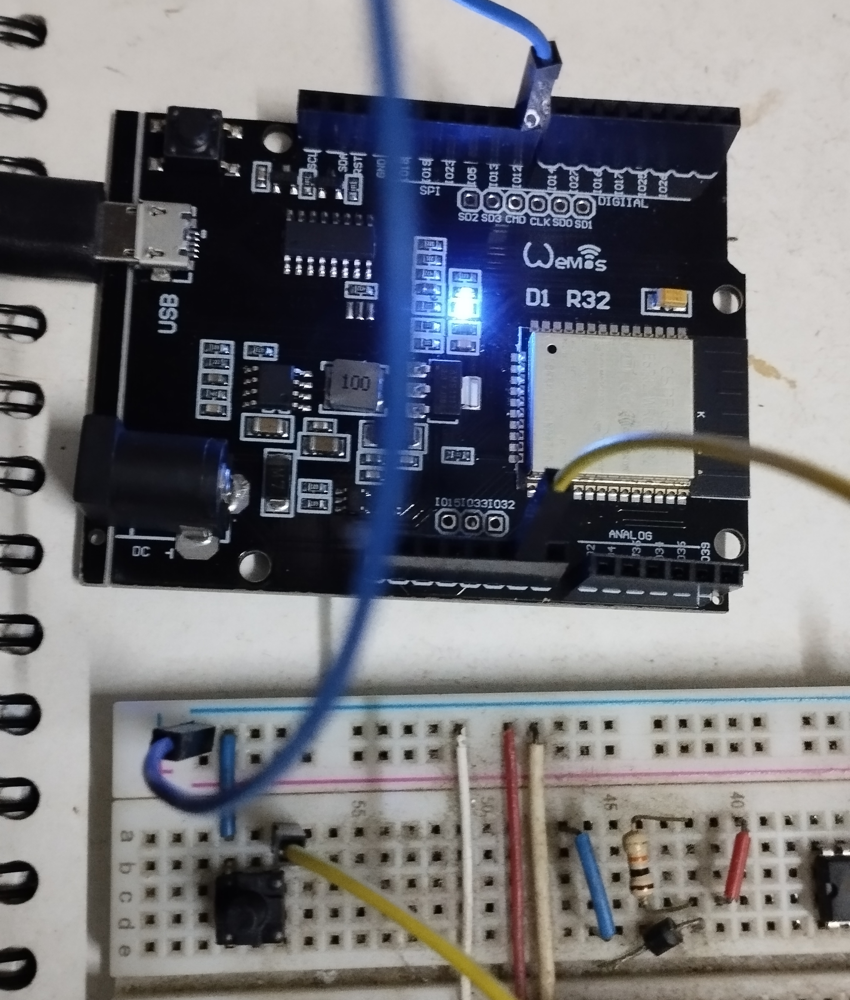

<!--
This is the content of the report, mean to be translated into LaTeX and compiled into a pdf file.
This can be done locally using pandoc with custom template.
But this is put here so that other member may take care of that instead.
-->

# Determine the stack size for each FreeRTOS task

The method is mentioned on Espressif ESP32 forum[^forum-stack-size].

The method works by using test code with `uxTaskGetStackHighWaterMark()`{.c} to test for stack usage of the task throughout its lifetime. The maximum usage determined plus some safety margin (25-30% perhaps) will be set as the stack size for the task within the final code.


[^forum-stack-size]: [https://www.esp32.com/viewtopic.php?t=4295](https://www.esp32.com/viewtopic.php?t=4295)

# Student ID printing task (cyclic)

```{.c .numberLines startFrom="1"}
void vPrintStudentID(void *pvParameters)
{
    while (1)
    {
        printf("Student ID: %d\n", STUDENT_ID);
        vTaskDelay(1000 / portTICK_PERIOD_MS);
    }
    vTaskDelete(NULL);
}
```

We determined the stack size for the task to be 2048 bytes.

- Testing show that the task uses about 1500 bytes.


# Button polling and printing task (acyclic)

```{.c .numberLines startFrom="1"}
void vDetectButtonPressAndPrint(void *pvParameters)
{
    int currentState = 0;
    int lastState = 0;
    int diffCount = 0;
    while (1)
    {
        currentState = gpio_get_level(GPIO_BUTTON);
        if (currentState != lastState)
            diffCount++;

        if (diffCount >= 5)
        {
            diffCount = 0;
            lastState = currentState;
            if (currentState == 0)
                printf("ESP32\n");
        }

        vTaskDelay(10 / portTICK_PERIOD_MS);
    }
    vTaskDelete(NULL);
}
```

We determined the stack size for the function to be 1024

- Testing show that the task uses about 600 bytes

# Main function

We set both task (button polling and ID printing) to the same priority, with no argument passed into them.

```{.c .numberLines startFrom="1"}
void initializeGPIO(void)
{
    // set the pin to be input
    gpio_reset_pin(GPIO_BUTTON);
    gpio_set_direction(GPIO_BUTTON, GPIO_MODE_INPUT);
    // set the pin to have internal pullup
    gpio_set_pull_mode(GPIO_BUTTON, GPIO_PULLUP_ONLY);
    gpio_pullup_en(GPIO_BUTTON);
}

void app_main(void)
{
    initializeGPIO();

    xTaskCreate(
        vPrintStudentID,
        "Print student ID",
        2048,
        NULL,
        1,
        &printID_handle
    );

    xTaskCreate(
        vDetectButtonPressAndPrint,
        "Detect button press and print ESP32 if so",
        1024,
        NULL,
        1,
        &detectButton_handle
    );

#ifdef PRINT_FREE_STACK
    while (1)
    {
        printf("%u\n", uxTaskGetStackHighWaterMark(printID_handle));
        printf("%u\n", uxTaskGetStackHighWaterMark(detectButton_handle));
        vTaskDelay(1000 / portTICK_PERIOD_MS);
    }
#endif
}
```

# Is `vTaskStartScheduler()`{.c}  needed?

From the *ESP-IDF Programming Guide*, *Application Startup Flow*, section *Application starup*, subpart *Running the main task*.[^excerpt-doc]

> After all other components are initialized, the main task is created and the FreeRTOS scheduler starts running.
>
> After doing some more initialization tasks (that require the scheduler to have started), the main task runs the application-provided function `app_main` in the firmware.

This mean that before `app_main` is entered, the scheduler has already been started. So invoking `vTaskStartScheduler()`{.c} is not needed.


[^excerpt-doc]: [https://docs.espressif.com/projects/esp-idf/en/latest/esp32/api-guides/startup.html#running-the-main-task](https://docs.espressif.com/projects/esp-idf/en/latest/esp32/api-guides/startup.html#running-the-main-task)

# Images

<!-- Images will be added here for the completed project -->



