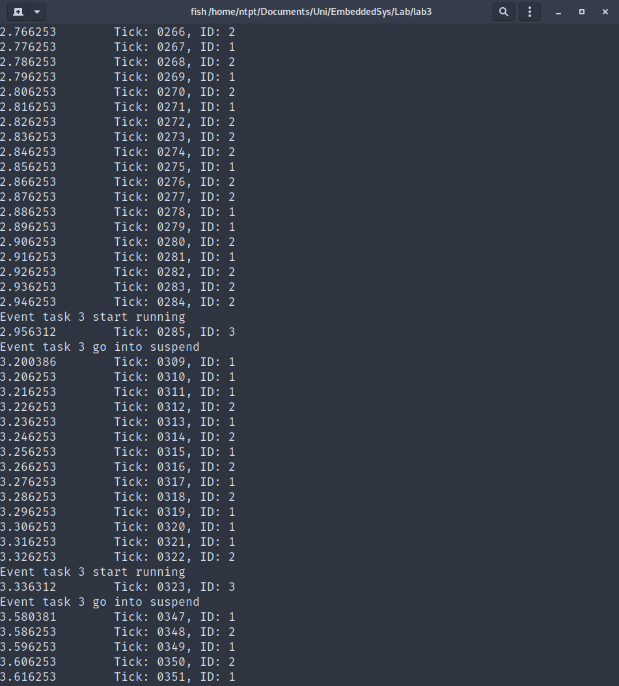
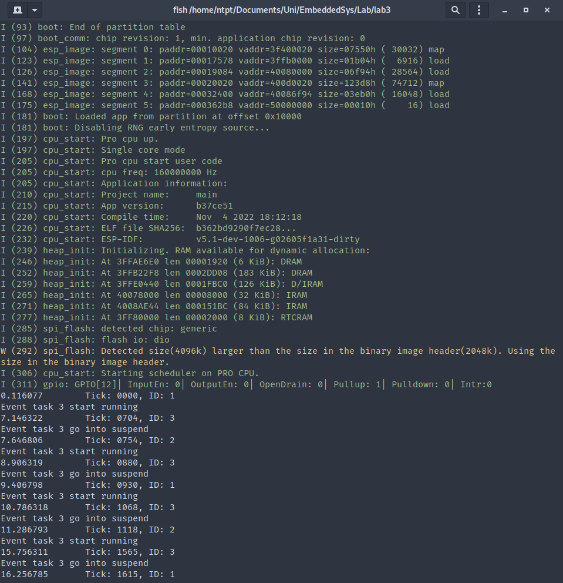
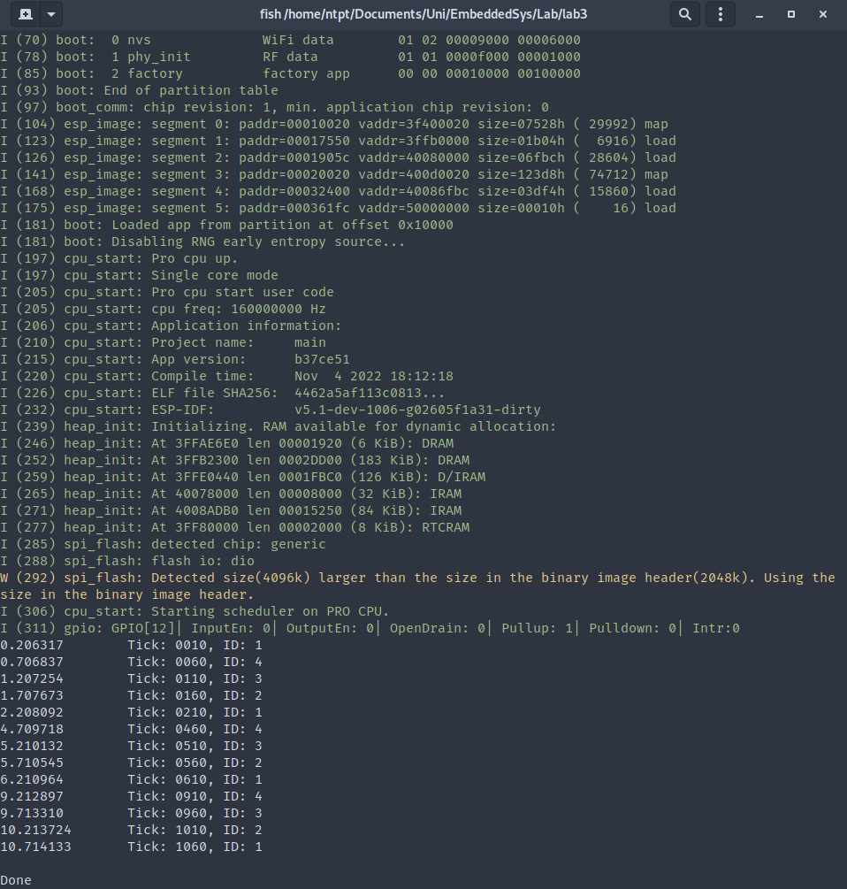
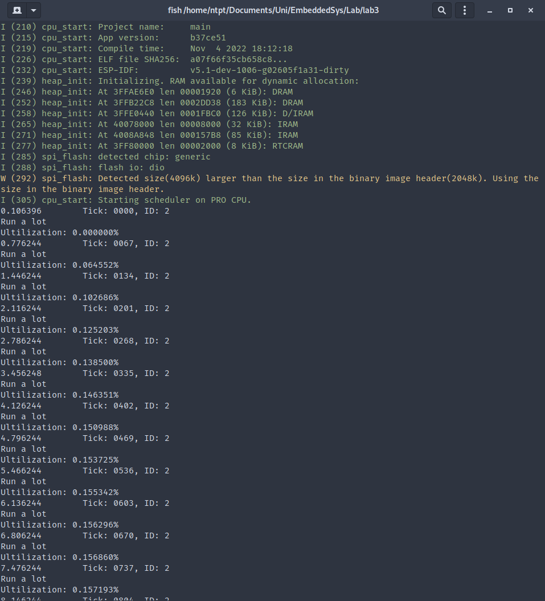

# Note
The file `FreeRTOSConfig.h` is modify throughout this report to choose the required schedule policy.
Such modification will be noted when needed for each section.

Within ESP-IDF framework, we has chosen the option of running all task for this project on one CPU core.
Such a option can be found in `idf.py menuconfig` command. We have also opted to turn off the task
watchdog timer to rid of the pesky timeout message.

# Exercises

We design and implement examples for various scheduling policy that FreeRTOS support

## Prioritized Pre-emptive Scheduling (with Time Slicing){#preempt_timeslice}

Within `FreeRTOSConfig.h`, `configUSE_PREEMPTION` is set to `1` and `configUSE_TIME_SLICING` is set
to `1`.

First we will create some helping function that accomodate showing the current time, current
tick count along with the task that is running during that tick count.

Within each task, the `uxLastTaskID` will be updated and `printCurrentState(void)` will be run
immediately afterward to determine and print out if the running task has changed for the
current tick.

```{.c .numberLines}
static uint32_t uxLastTaskID = -1u;
static uint32_t uxLastTaskID_old = -1u;

// compare the last task id with the current task id
// if different, some new task is running in the current tick, notify the change
// if not different, do nothing
void printCurrentState(void)
{
    if (uxLastTaskID != uxLastTaskID_old)
    {
        uxLastTaskID_old = uxLastTaskID;

        // print out the current time and tick count and task id
        struct timeval tv_now;
        gettimeofday(&tv_now, NULL);
        printf("%lld.%06ld\tTick: %04lu, ID: %lu\n",
               tv_now.tv_sec, tv_now.tv_usec, xTaskGetTickCount(), uxLastTaskID);
    }
}
```

We defined two task for the continous and event driven type. Parameter for each task is their task ID.
Note that the event driven type will suspend itself and only resume on button press.

```{.c .numberLines}
void vContinuousTask(void *param)
{
    while (1)
    {
        uxLastTaskID = (uint32_t) param;
        printCurrentState();
    }

    vTaskDelete(NULL);
}

void vEventTask(void *param)
{
    // suspend task upon creation, will be woke up by button
    vTaskSuspend(NULL);

    while (1)
    {
        printf("Event task %lu start running\n", (uint32_t) param);

        for (UBaseType_t i = 0; i < SHORT_TASK_LOOPS_COUNT; i++)
        {
            uxLastTaskID = (uint32_t) param;
            printCurrentState();
        }

        // go into suspend, the button interrupt will wake this up again
        printf("Event task %lu go into suspend\n", (uint32_t) param);
        vTaskSuspend(NULL);
    }
    vTaskDelete(NULL);
}
```

The ISR for the button press and initializing the button code is as follow. Wiring for the button
on the breadboard is similar to our group Lab02 report.

```{.c .numberLines}
void IRAM_ATTR button_press_handler(void* arg)
{
    xTaskResumeFromISR(eventTask03_handle);
}

void initializeGPIO(void)
{
    // set the pin to be input
    gpio_reset_pin(GPIO_BUTTON);
    gpio_set_direction(GPIO_BUTTON, GPIO_MODE_INPUT);
    // set the pin to have internal pullup
    gpio_set_pull_mode(GPIO_BUTTON, GPIO_PULLUP_ONLY);
    gpio_pullup_en(GPIO_BUTTON);
    //set up the interrupt
    gpio_install_isr_service(ESP_INTR_FLAG_LOWMED);
    gpio_set_intr_type(GPIO_BUTTON, GPIO_INTR_NEGEDGE); // on negative edge
    gpio_isr_handler_add(GPIO_BUTTON, button_press_handler, NULL);
    gpio_intr_enable(GPIO_BUTTON);
}
```

Task will be initialized with varying priority

```{.c .numberLines}

void app_main(void)
{
    // increase priority of current task so newly created task
    // doesn't hog cpu until finish creating all task
    vTaskPrioritySet(NULL, 10);

    // set up gpio for button and interrupt
    initializeGPIO();

    // two continuous task, equal priority
    xTaskCreate(vContinuousTask, "Continous task #1", 2048,
        (void*) 1u, 1, &contTask01_handle);
    xTaskCreate(vContinuousTask, "Continous task #2", 2048,
        (void*) 2u, 1, &contTask02_handle);

    // one event task
    xTaskCreate(vEventTask, "Event task #3", 2048, (void*) 3, 2, &eventTask03_handle);

    vTaskDelete(NULL);
}

```

Running the task with some randomly timed button pressed, the ESP32 print out the following



## Prioritized Pre-emptive Scheduling (without Time Slicing)

Within `FreeRTOSConfig.h`, `configUSE_PREEMPTION` is set to `1` and `configUSE_TIME_SLICING` is set
to `0`.

The code for the [last section](#preempt_timeslice) is also used for this section

Running the task with some randomly timed button pressed, the ESP32 print out the following



## Co-operative Scheduling

Within `FreeRTOSConfig.h`, `configUSE_PREEMPTION` is set to `0` and `configUSE_TIME_SLICING` is set
to `0`.

For this example, we need to refine some old function and define new one.

For the button press ISR and GPIO initialization for the button pin.

```{.c .numberLines}
void IRAM_ATTR button_press_handler(void* arg)
{
    xTaskResumeFromISR(yieldTask01_handle);
    xTaskResumeFromISR(yieldTask02_handle);
    xTaskResumeFromISR(yieldTask03_handle);
    xTaskResumeFromISR(yieldTask04_handle);
}

void initializeGPIO(void)
{
    // set the pin to be input
    gpio_reset_pin(GPIO_BUTTON);
    gpio_set_direction(GPIO_BUTTON, GPIO_MODE_INPUT);
    // set the pin to have internal pullup
    gpio_set_pull_mode(GPIO_BUTTON, GPIO_PULLUP_ONLY);
    gpio_pullup_en(GPIO_BUTTON);
    //set up the interrupt
    gpio_install_isr_service(ESP_INTR_FLAG_LOWMED);
    gpio_set_intr_type(GPIO_BUTTON, GPIO_INTR_NEGEDGE); // on negative edge
    gpio_isr_handler_add(GPIO_BUTTON, button_press_handler, NULL);
    gpio_intr_enable(GPIO_BUTTON);
}
```

And a new task is created with yielding capability. After they all suspended, they can be resumed from
a button press.

```{.c .numberLines}
// these task run for a while (YIELD_TASK_LOOPS_COUNT) and then yield
void vTaskWithYield(void *param)
{
    uint32_t taskID = (uint32_t) param;
    // delay starting the task by taskid * 10 ticks
    vTaskDelay(10 * taskID);

    while (1)
    {
        for (UBaseType_t i = 0; i < YIELD_TASK_LOOPS_COUNT; i++)
        {
            uxLastTaskID = taskID;
            printCurrentState();
        }

        if (taskID > 1)
        {
            // suspend higher priority task to simulate them going into
            // blocked state, they will be resume on button press
            vTaskSuspend(NULL);
        }
        else
        {
            taskYIELD();
        }
    }

    vTaskDelete(NULL);
}
```

Task is create in `main(void)`. Running the program with ESP32 while doing random button press shows
that the program is able to demonstate co-operative behavior.

```{.c .numberLines}
void app_main(void)
{
    // increase priority of current task so newly created task
    // doesn't hog cpu until finish creating all task
    vTaskPrioritySet(NULL, 10);

    // set up gpio for button and interrupt
    initializeGPIO();

    // four task with yield, increasing priority, id = priority
    xTaskCreate(vTaskWithYield, "Yielding task #1", 2048,
        (void*) 1u, 1, &yieldTask01_handle);
    xTaskCreate(vTaskWithYield, "Yielding task #2", 2048,
        (void*) 2u, 2, &yieldTask02_handle);
    xTaskCreate(vTaskWithYield, "Yielding task #3", 2048,
        (void*) 3u, 3, &yieldTask03_handle);
    xTaskCreate(vTaskWithYield, "Yielding task #4", 2048,
        (void*) 4u, 4, &yieldTask04_handle);

    vTaskDelete(NULL);
}
```



## CPU utilization with Idle hook

The code for this exercise resides in file `extra.c` (within the same directory of `main.c`).

The required idle hook is as follow

```{.c .numberLines}
// Idle hook
// NOTE: configIDLE_SHOULD_YIELD needs to be set to 0
void vApplicationIdleHook(void)
{
    uxLastTaskID = uxLastTaskID_old = 0u;
    TickType_t xCurrentIdleEnterTick = xTaskGetTickCount();

    // the utilization during the period (xLastIdleEnterTick -> xCurrentIdleEnterTick)
    // is 1 - 1 / (xCurrentIdleEnterTick - xLastIdleEnterTick)
    // this is because the idle task will take up only one tick during that period
    float ultilizationDuringPeriod;
    if (xCurrentIdleEnterTick == xLastIdleEnterTick)
    {
        ultilizationDuringPeriod = 0;
    }
    else
    {
        ultilizationDuringPeriod = 1.0f
            - 1.0f / (xCurrentIdleEnterTick - xLastIdleEnterTick);
    }

    // update the total ultilization
    // the formula is of exponential moving average (smoothing)
    // https://en.wikipedia.org/wiki/Exponential_smoothing
    ultilization = ultilization * EXPONENTIAL_WEIGHT_PAST
        + ultilizationDuringPeriod * EXPONENTIAL_WEIGHT_CURRENT;

    xLastIdleEnterTick = xCurrentIdleEnterTick;
}
```

The main idea of this method of calculating utilization is by assuming:

- When the idle task start running, it will take up a whole tick

- The last time the idle task was run can be store (as tick count)

Then the we know for sure that the idle task only run for 1 tick during the period between
the last tick the idle task was run and the current tick that the idle task is currently running.

Utilization within such period can be calculate as

$$
u_{period} = 1 - \frac{1}{currentTickCount - lastTickCount}
$$

Then, calculating the current utilization is performed by taking the exponential moving average
of the period utilization. The formula for that is

\begin{align*}
u_{0} &= 0 \\
u_{n} &= \alpha u_{period} + (1 - \alpha) u_{n-1}
\end{align*}

with arbitrarily chosen $\alpha$ ($0.1$ within this example).

We perform some test with a test task

```{.c .numberLines}
void vTestTask(void *param)
{
    while (1)
    {
        uxLastTaskID = (uint32_t) param;
        printCurrentState();

        // run a lot
        printf("Run a lot\n");
        for (BaseType_t i = 0; i < 10000000u; i++)
        {
            __asm__ ("NOP"); // nop - do nothing
        }
        printf("Ultilization: %f%%\n", ultilization);
        vTaskDelay(3); // change this to see changes in utilization
    }

    vTaskDelete(NULL);
}

void app_main(void)
{
    xTaskCreate(vTestTask, "Test task", 2048, (void*) 2, 1, NULL);

    vTaskDelete(NULL);
}
```


