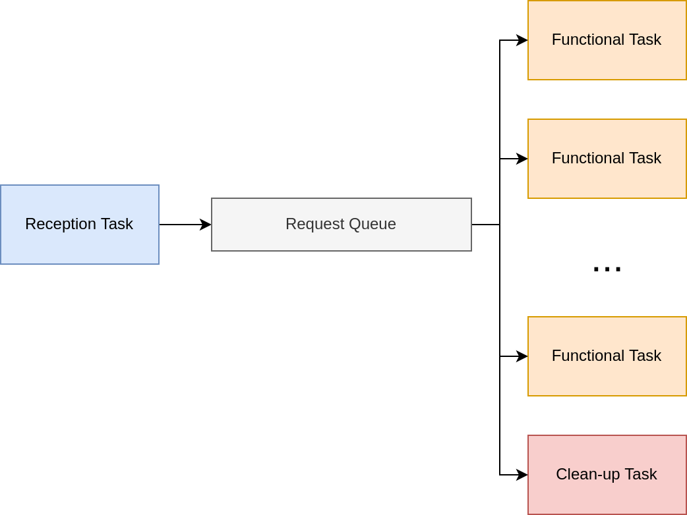
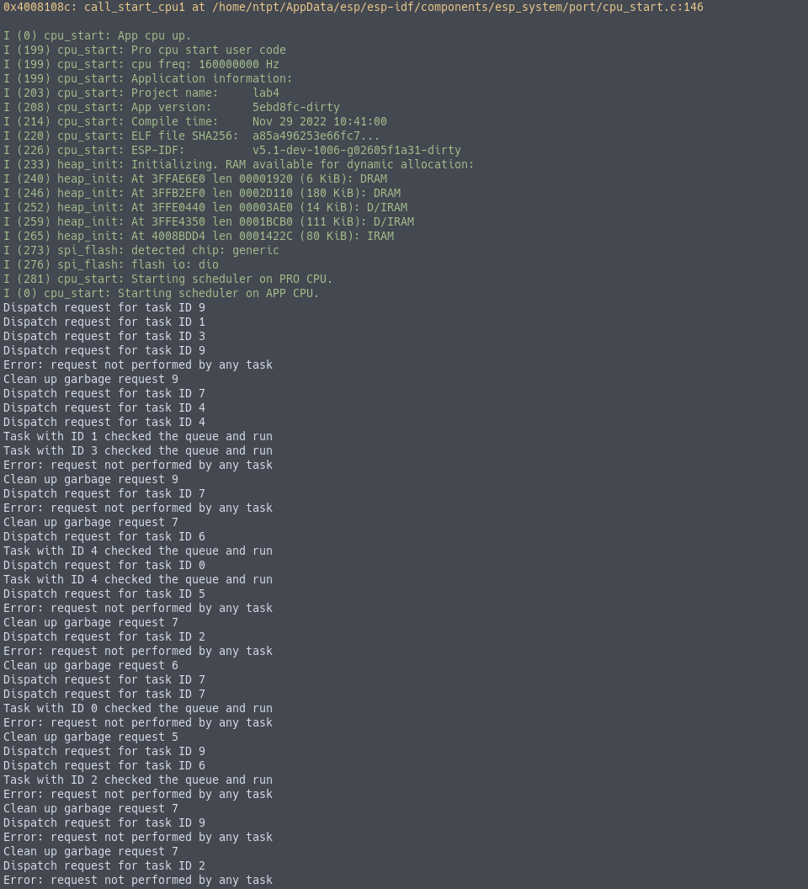

# Note

For this project, the code is divided between many source file. This requires configuring the build
system (making change to list all the source file added in `main/CMakeLists.txt`).

We design the program to be run on both two core of the ESP32.

# Implementation

## Short description

The system will consists of 3 type of main task

- Reception task
  This task will get a random ID number (within pre-configured range), add it to the request queue.

- Functional task
  There will be many instance of such task, each with different ID passed in as parameter. The
  functional task will read the queue, determined if the request is directed to it (by comparing ID
  value) and perform some work (receive request, print notice, wake other functional task). If the
  current request is not directed to it, the functional task will go into suspend to prevent
  rechecking.

- Clean-up task
  This task will be used to clean up garbage request (which don't have a valid ID to be processed by
  a functional task). After cleaning up such a request, it will wake up all suspended functional
  task to process the next request.

{width=70%}

## Prevention of rechecking

If we let all task run freely, the situation where a task would rechecked a already checked (and
determined not directed at itself) request is unavoidable. Such rechecking waste computational
resource and context switch time. Letting the scheduler policy freely determined the order of
checking like that will likely not scale well when the amount of functional task increases. Adding
to such difficulty, we have no way to deterministically make sure that the clean-up task will run
after all the functional task has already checked the request (with different priority, CPU may be
bounded by functional task forever,...).

By setting an array of boolean value, we can store the status of if a certain functional task has
checked the current request. Combining state storing with suspending when the check fails, we can
guarantee that clean-up task will run eventually and is able to test if all the task has checked the
request.

## Synchronization

Different task within the project will concurrently (due to the multicore nature of ESP32) or in
parallel (as in multiprocessing task on a single core) access and write to these resource

- Common request queue

- Boolean array of checking status

The queue implementation within FreeRTOS is thread-safe and can be used as-is.  The status array can
be protect across core and task by a simple mutex (using FreeRTOS's mutex type).

## Global object

All global object that are used through out the project (between many source file) are declared
within `main.h`.

```{.c}
#define FUNCTIONAL_TASK_NUM (5)
#define ADDED_GARBAGE_REQUEST (5)
#define QUEUE_SIZE (FUNCTIONAL_TASK_NUM)

// global queue
extern QueueHandle_t queue;

// mutex to avoid race condition when accessing queue and already_process
// the esp32 have two core after all
extern SemaphoreHandle_t mt;

// global uint8_t array that serve as bool, each task will set the corresponding
// element to signify that the signal has been read by the task and determined
// not to process it
extern uint8_t already_process[FUNCTIONAL_TASK_NUM];

// task handle to selectively resume functional task
extern TaskHandle_t func_task_handle_list[FUNCTIONAL_TASK_NUM];
```

`ADDED_GARBAGE_REQUEST` is used to configure the amount of garbage request within the random ID
range that reception task will generate.

## Reception task

```{.c}
void reception_task(void *param)
{
    bootloader_random_enable();

    while (1)
    {
        size_t random_task_id = esp_random() %
            (FUNCTIONAL_TASK_NUM + ADDED_GARBAGE_REQUEST);

        Request_t new_req =
        {
            .forTaskID = random_task_id
        };

        if  (xQueueSend(queue, &new_req, portMAX_DELAY) == pdPASS)
        {
            // success, do nothing
            printf("Dispatch request for task ID %zu\n", random_task_id);
        }
        else
        {
            // fail to add request to queue, print error
            printf("Error: reception_task can't add request to queue\n");
            printf("New req: %zu", new_req.forTaskID);
        }
    }

    bootloader_random_disable();

    vTaskDelete(NULL);
}
```

## Functional task

```{.c}
void functional_task(void *param)
{
    size_t id = (size_t) param;

    while (1)
    {
        Request_t new_req;
        if (xQueuePeek(queue, &new_req, portMAX_DELAY) == pdPASS)
        {
            if (new_req.forTaskID == id)
            {
                // remove the request from queue
                xQueueReceive(queue, &new_req, portMAX_DELAY); // should success

                xSemaphoreTake(mt, portMAX_DELAY);
                clear_already_process();
                xSemaphoreGive(mt);

                // do something
                printf("Task with ID %zu checked the queue and run\n", id);
                // then wake up all other suspended task
                wake_all_functional();
            }
            else
            {
                // not match, set already_process to 1, then go into suspend
                // to prevent checking the request again
                xSemaphoreTake(mt, portMAX_DELAY);
                already_process[id] = 1;
                xSemaphoreGive(mt);

                vTaskSuspend(NULL);
                continue;
            }
        }
    }

    vTaskDelete(NULL);
}
```

## Clean-up task

```{.c}
void garbage_request_cleaner_task(void *param)
{
    while (1)
    {
        // check if all task has process the request
        xSemaphoreTake(mt, portMAX_DELAY);
        uint8_t all_checked = check_all_already_process();
        xSemaphoreGive(mt);

        if (all_checked)
        {
            Request_t garbage_reg;

            // remove the request from queue
            xQueueReceive(queue, &garbage_reg, portMAX_DELAY); // should success

            xSemaphoreTake(mt, portMAX_DELAY);
            clear_already_process();
            xSemaphoreGive(mt);

            printf("Error: request not performed by any task\n");
            printf("Clean up garbage request %zu\n", garbage_reg.forTaskID);
            // then wake up all other suspended task
            wake_all_functional();
        }
    }

    vTaskDelete(NULL);
}
```

## Resource initialization and task creation in `app_main()`

```{.c}
QueueHandle_t queue;
SemaphoreHandle_t mt;
uint8_t already_process[FUNCTIONAL_TASK_NUM] = { 0 };
TaskHandle_t func_task_handle_list[FUNCTIONAL_TASK_NUM];

void app_main(void)
{
    queue = xQueueCreate(sizeof(Request_t), QUEUE_SIZE);
    mt = xSemaphoreCreateMutex();

    xTaskCreate(reception_task, "Reception task", 2048, NULL,
            1, NULL);

    for (size_t i = 0; i < FUNCTIONAL_TASK_NUM; i++)
    {
        xTaskCreate(functional_task, "Functional task", 2048, (void*) i,
                1, &func_task_handle_list[i]);
    }

    xTaskCreate(garbage_request_cleaner_task, "Cleanup task", 2048, NULL,
            1, NULL);

    vTaskDelete(NULL);
}
```


